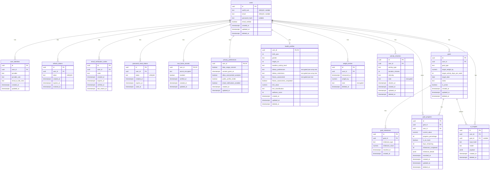

# ER Diagram (Current Schema)

```mermaid
erDiagram
  users {
    uuid id PK
    text auth0_sub "UNIQUE, nullable"
    text email "UNIQUE, nullable"
    text password_hash "nullable"
    boolean email_verified
    timestamptz created_at
    timestamptz updated_at
    timestamptz deleted_at
  }

  user_identities {
    uuid id PK
    uuid user_id FK
    text provider
    text provider_sub
    text email_at_link_time
    timestamptz created_at
    timestamptz updated_at
  }

  refresh_tokens {
    uuid id PK
    uuid user_id FK
    text token "UNIQUE"
    timestamptz created_at
    timestamptz expires_at
    timestamptz revoked_at
  }

  email_verification_codes {
    uuid id PK
    uuid user_id FK
    text code
    timestamptz created_at
    timestamptz expires_at
    timestamptz verified_at
    timestamptz last_resent_at
  }

  password_reset_tokens {
    uuid id PK
    uuid user_id FK
    text token "UNIQUE"
    timestamptz created_at
    timestamptz expires_at
    timestamptz used_at
  }

  two_factor_secrets {
    uuid user_id PK,FK
    text secret_encrypted
    boolean enabled
    timestamptz verified_at
    timestamptz created_at
    timestamptz updated_at
  }

  privacy_preferences {
    uuid user_id PK,FK
    boolean data_usage_consent
    timestamptz consent_given_at
    boolean allow_anonymized_analytics
    boolean public_profile_visible
    boolean email_notifications_enabled
    timestamptz created_at
    timestamptz updated_at
  }

  health_profiles {
    uuid user_id PK,FK
    int birth_year
    text gender
    int height_cm
    text baseline_activity_level
    text dietary_preferences "encrypted json-array text"
    text dietary_restrictions "encrypted json-array text"
    text fitness_assessment "encrypted json text"
    boolean fitness_assessment_completed
    numeric bmi_value
    text bmi_classification
    int wellness_score
    timestamptz created_at
    timestamptz updated_at
    timestamptz deleted_at
  }

  weight_entries {
    uuid id PK
    uuid user_id FK
    timestamptz measured_at
    numeric weight_kg
    text note "encrypted"
    timestamptz deleted_at
  }

  activity_checkins {
    uuid id PK
    uuid user_id FK
    text activity_type
    int duration_minutes
    text intensity
    text note "encrypted"
    timestamptz checkin_at
    timestamptz created_at
    timestamptz updated_at
    timestamptz deleted_at
  }

  goals {
    uuid id PK
    uuid user_id FK
    text goal_type
    numeric target_weight_kg
    int target_activity_days_per_week
    date target_date
    text notes
    boolean is_active
    timestamptz created_at
    timestamptz updated_at
    timestamptz deleted_at
  }

  goal_progress {
    uuid id PK
    uuid goal_id FK
    uuid user_id FK
    numeric current_value
    int progress_percentage
    boolean is_on_track
    int days_remaining
    int milestones_completed
    jsonb milestone_details
    timestamptz recorded_at
    timestamptz created_at
    timestamptz updated_at
    timestamptz deleted_at
  }

  goal_milestones {
    uuid id PK
    uuid goal_id FK
    text milestone_type
    numeric milestone_value
    timestamptz reached_at
    timestamptz created_at
  }

  ai_insights {
    uuid id PK
    uuid user_id FK
    uuid goal_id FK "nullable"
    text input_hash
    text model
    jsonb payload
    timestamptz created_at
    timestamptz deleted_at
  }

  users ||--o{ user_identities : has
  users ||--o{ refresh_tokens : has
  users ||--o{ email_verification_codes : has
  users ||--o{ password_reset_tokens : has
  users ||--o| two_factor_secrets : has
  users ||--o| privacy_preferences : has
  users ||--o| health_profiles : has
  users ||--o{ weight_entries : has
  users ||--o{ activity_checkins : has
  users ||--o{ goals : has
  goals ||--o{ goal_progress : has
  goals ||--o{ goal_milestones : has
  users ||--o{ goal_progress : owns
  users ||--o{ ai_insights : has
  goals ||--o{ ai_insights : context
```
